---
# Front matter
lang: ru-RU
title: "Отчет по лабораторной работе №5"
subtitle: "Дисциплина: операционные системы"
author: "Сергеев Тимофей Сергеевич"

# Formatting
toc-title: "Содержание"
toc: true # Table of contents
toc_depth: 2
lof: true # List of figures
lot: true # List of tables
fontsize: 12pt
linestretch: 1.5
papersize: a4paper
documentclass: scrreprt
polyglossia-lang: russian
polyglossia-otherlangs: english
mainfont: PT Serif
romanfont: PT Serif
sansfont: PT Sans
monofont: PT Mono
mainfontoptions: Ligatures=TeX
romanfontoptions: Ligatures=TeX
sansfontoptions: Ligatures=TeX,Scale=MatchLowercase
monofontoptions: Scale=MatchLowercase
indent: true
pdf-engine: lualatex
header-includes:
  - \linepenalty=10 # the penalty added to the badness of each line within a paragraph (no associated penalty node) Increasing the value makes tex try to have fewer lines in the paragraph.
  - \interlinepenalty=0 # value of the penalty (node) added after each line of a paragraph.
  - \hyphenpenalty=50 # the penalty for line breaking at an automatically inserted hyphen
  - \exhyphenpenalty=50 # the penalty for line breaking at an explicit hyphen
  - \binoppenalty=700 # the penalty for breaking a line at a binary operator
  - \relpenalty=500 # the penalty for breaking a line at a relation
  - \clubpenalty=150 # extra penalty for breaking after first line of a paragraph
  - \widowpenalty=150 # extra penalty for breaking before last line of a paragraph
  - \displaywidowpenalty=50 # extra penalty for breaking before last line before a display math
  - \brokenpenalty=100 # extra penalty for page breaking after a hyphenated line
  - \predisplaypenalty=10000 # penalty for breaking before a display
  - \postdisplaypenalty=0 # penalty for breaking after a display
  - \floatingpenalty = 20000 # penalty for splitting an insertion (can only be split footnote in standard LaTeX)
  - \raggedbottom # or \flushbottom
  - \usepackage{float} # keep figures where there are in the text
  - \floatplacement{figure}{H} # keep figures where there are in the text
---

# Цель работы

Приобретение практических навыков взаимодействия пользователя с системой
посредством командной строки.

# Выполнение лабораторной работы

1. Определите полное имя вашего домашнего каталога. Далее относительно этого
каталога будут выполняться последующие упражнения.

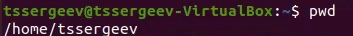{ #fig:001 width=70% }

2. Выполните следующие действия:
   
   1. Перейдите в каталог /tmp.
   
   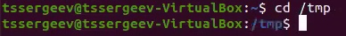{ #fig:002 width=70% }

   2. Выведите на экран содержимое каталога /tmp. Для этого используйте команду ls с различными опциями. 
   
   Поясните разницу в выводимой на экран
информации.

   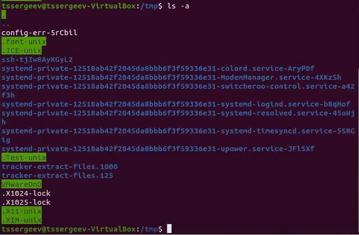{ #fig:003 width=70% }

   { #fig:004 width=70% }

   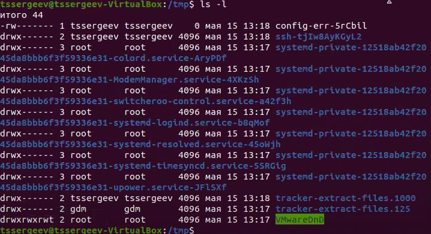{ #fig:005 width=70% }

   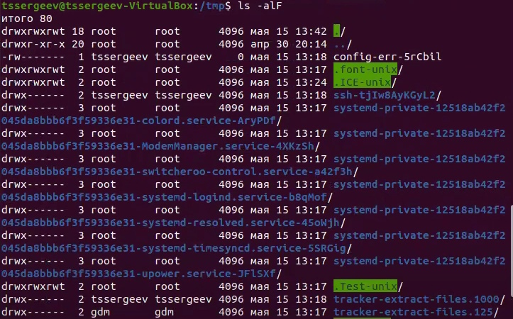{ #fig:006 width=70% }

   Разница: первые три опции дают разные сведения, а последняя - общую информацию этих трех команд.

   3. Определите, есть ли в каталоге /var/spool подкаталог с именем cron?
  
   Этот подкаталог есть.

   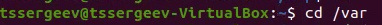{ #fig:007 width=70% }

   { #fig:008 width=70% }

   4. Перейдите в Ваш домашний каталог и выведите на экран его содержимое.
   
   Определите, кто является владельцем файлов и подкаталогов?

   Я являюсь владельцем:

   { #fig:009 width=70% }

3. Выполните следующие действия:
   1. В домашнем каталоге создайте новый каталог с именем newdir.

{ #fig:010 width=70% }

   2. В каталоге ~/newdir создайте новый каталог с именем morefun.

{ #fig:011 width=70% }

   3. В домашнем каталоге создайте одной командой три новых каталога с именами letters, memos, misk. Затем удалите эти каталоги одной командой.

{ #fig:012 width=70% }

{ #fig:013 width=70% }

   4. Попробуйте удалить ранее созданный каталог ~.newdir командой rm. Проверьте, был ли каталог удалён.
   
   Каталог не будет удален, т.к. он не пустой, нужна другая команда

{ #fig:014 width=70% }

   5. Удалите каталог ~/newdir/morefun из домашнего каталога. Проверьте, был ли каталог удалён.
   
   Удаляется только подкаталог morefun, а не вся ветка

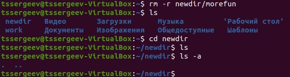{ #fig:015 width=70% }

4. С помощью команды man определите, какую опцию команды ls нужно использовать для просмотра содержимое не только указанного каталога, но и подкаталогов, входящих в него.

{ #fig:016 width=70% }

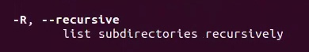{ #fig:017 width=70% }

5. С помощью команды man определите набор опций команды ls, позволяющий отсортировать по времени последнего изменения выводимый список содержимого
каталога с развёрнутым описанием файлов.

{ #fig:018 width=70% }

6. Используйте команду man для просмотра описания следующих команд: cd, pwd,
mkdir, rmdir, rm. Поясните основные опции этих команд.

Опций нет:
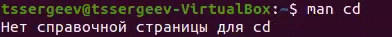{ #fig:019 width=70% }

Основные опции pwd:

-L, --logical - брать директорию из переменной окружения, даже если она содержит символические ссылки;

-P - отбрасывать все символические ссылки;

--help - отобразить справку по утилите;

--version - отобразить версию утилиты.

{ #fig:020 width=70% }

Основные опции mkdir:

-m режим_доступа - Явное задание режима_доступа для создаваемых каталогов [см. chmod];

-p - При указании этой опции перед созданием нового каталога предварительно создаются все несуществующие вышележащие каталоги.

{ #fig:021 width=70% }

Основные опции rmdir:

-p	- Позволяет удалить каталог и вышележащие каталоги, оказавшиеся пустыми. На стандартный вывод выдается сообщение об удалении всех указанных в маршруте каталогов или о сохранении части из них по каким-либо причинам.
-s - Подавление сообщения, выдаваемого при действии опции -p.

{ #fig:022 width=70% }

Основные опции rm:

-r [dir name] - Если вы пытаетесь удалить каталог, вам необходимо использовать параметр командной строки -r. В противном случае rm выдаст ошибку, указывающую, что вы пытаетесь удалить каталог.

-i [file or dir] - Если вы хотите, чтобы rm запрашивала подтверждение перед каждым удалением, используйте опцию -i командной строки.

{ #fig:023 width=70% }

7. Используя информацию, полученную при помощи команды history, выполните
модификацию и исполнение нескольких команд из буфера команд.

{ #fig:024 width=70% }

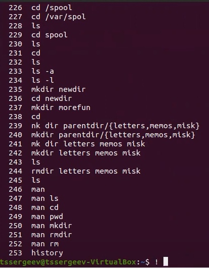{ #fig:025 width=70% }

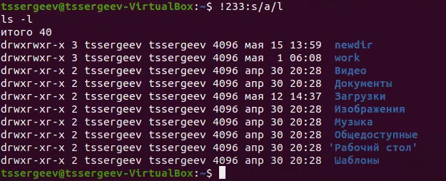{ #fig:026 width=70% }

# Выводы

После выполнения поставленных задач я приобрел практические навыкы взаимодействия пользователя с системой посредством командной строки.
